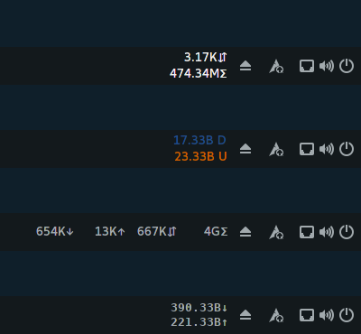
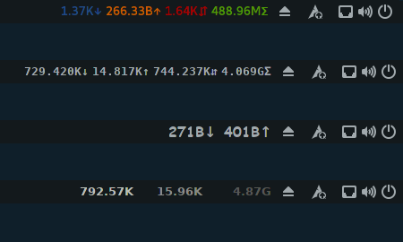
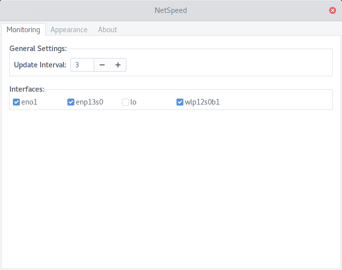
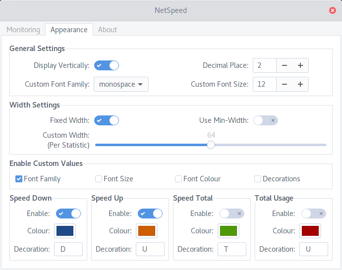

# About
NetSpeed Plus is (another) Gnome Shell extension providing a readout of your network throughput on the main panel. It was originally based off the stock NetSpeed plugin by [biji](https://github.com/biji/simplenetspeed) but has evolved to become focus on customisable appearance and monitoring. At a user-determined interval the contents of `/proc/net/dev` is read, and speed/usage statistics are calculated for the currently monitored interfaces.

# Features
NetSpeed Plus has a range of features not currently offered by other alternatives:
- Easily select which interfaces to monitor and change them on the fly via the preferences dialog
- Only show the statistics you want, select from up/down/total speed and/or total usage
- Chose how often the statistics update
- Customise appearance with font family, size, colour, and more
- Preserve usage statistics across extension restarts caused by logging out, locking the screen, etc.

# Installation
Installation is similar to any other shell extension installed from source:
1. `git clone https://github.com/tomha/gnome-shell-extension-netspeed-plus netspeed-plus@tomha.github.com` (The destination folder name is important).
2. `cp -r netspeed-plus@tomha.github.com ~/.local/share/gnome-shell/extensions/`
3. Restart the Gnome Shell - press `ALT + F2`, type `r`, and press `ENTER`.
4. Activate via your preferred method.
  * Enable the extension in Gnome Tweak Tools.
  * Enable via command line: `gnome-shell-extension-tool -e netspeed-plus@tomha.github.com`

The extension is not currently on the Gnome Extensions site, but this will likely happen in the future.
