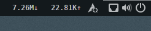

# About
NetSpeed is (another) Gnome Shell extension providing a readout of your network throughput on the main panel.

I created it to familiarise myself with the Gnome Shell Extension structure, using the Simple Net Speed extension by biji (https://github.com/biji/simplenetspeed) as inspiration. Functionally it is similar to the aforementioned extension, though for simplicity's sake I have not included multiple modes, instead electing to simply display Kilo/Mega/Giga-Bytes of throughput on selected interface, per second, based on the output of `/proc/net/dev`.

# Installation
Installation is similar to any other shell extension:
1. `git clone https://github.com/tomha/gnome-shell-extension-netspeed netspeed@tomha.github.com`
2. `cp -r netspeed@tomha.github.com ~/.local/share/gnome-shell/extensions/`
3. Restart the Gnome Shell - press `ALT + F2`, type `r`, and press `ENTER`.
4. Activate via your preferred method.
  * Enable the extension in Gnome Tweak Tools.
  * Enable via command line: `gnome-shell-extension-tool -e netspeed@tomha.github.com`
